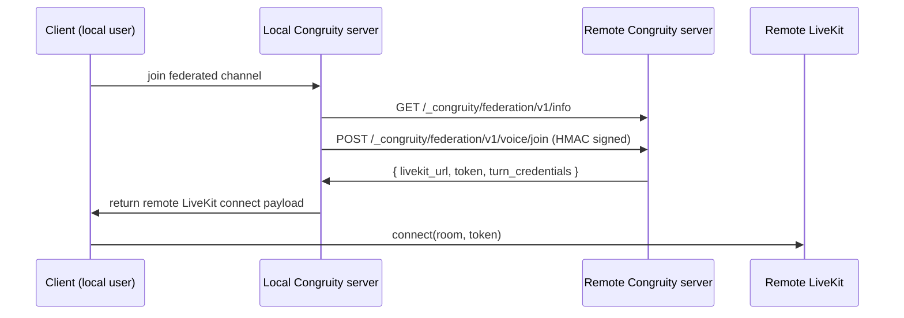

# Voice Architecture

Congruity uses two call paths:

1. DM/Private calls: peer-to-peer WebRTC (P2P)
2. Channel voice/video rooms: LiveKit SFU

## Why two paths

- P2P in DMs keeps one-to-one calls simple and low-overhead.
- SFU for channel rooms scales to larger groups, screen share, and mixed media.

## DM Calls (P2P)

- Signaling: existing signaling server (`/api/voice/dm/signal` + `dm:call:*` socket events)
- Media path: direct browser-to-browser WebRTC
- ICE: STUN first, TURN fallback from `/api/voice/turn-credentials`
- Current scope: max 2 participants

## Channel Voice Rooms (SFU)

- Room owner server issues LiveKit JWT via `/api/voice/channel/join`
- Client connects directly to owner LiveKit instance (`livekit_url + token`)
- Leave via `/api/voice/channel/leave`
- Pre-join roster via `/api/voice/channel/:channel_id/participants`

## Self-hosting requirements

- Open ports:
  - `7880` LiveKit API/WebSocket
  - `7881` LiveKit TCP
  - `7882/udp` LiveKit UDP
  - `3478` TURN UDP/TCP
  - `5349` TURN TLS (recommended)
- `LIVEKIT_API_KEY`, `LIVEKIT_API_SECRET`, `TURN_SECRET`, and `TURN_HOST` must be configured.

## TURN requirements

TURN is required for NAT-restricted networks where direct ICE candidates fail.

- Credentials are time-limited HMAC credentials (24h TTL)
- Backend generates credentials per user with `TURN_SECRET`
- No static user/password stored for clients

## Federation voice flow

## Privacy model

- Voice/video media is not recorded by default.
- DM text privacy requires end-to-end encryption to hide content from server operators.
- Current Supabase-backed message storage allows host operators with DB access to read stored plaintext DMs.
- For privacy-first DM guarantees, implement E2EE payload encryption on the client before persistence.

## Cost model

- Self-hosters pay for their own compute/bandwidth.
- Congruity Cloud can offer managed hosting, but channel room media still runs on the room owner’s configured LiveKit infrastructure in federation mode.
